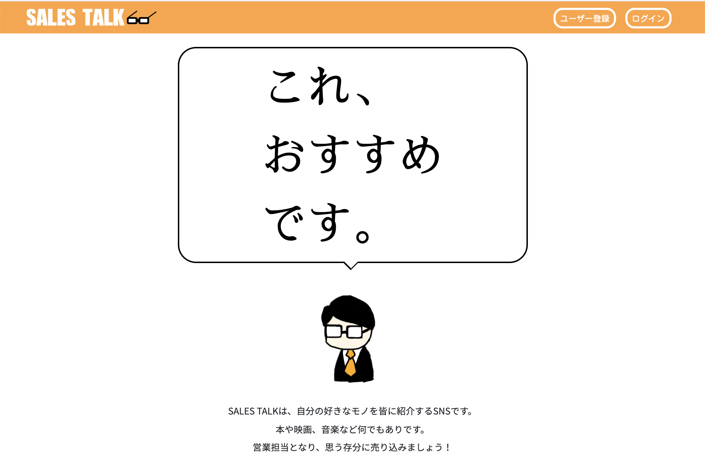

# SALES TALK

https://www.sales-talk.net/  
SALES TALKは、自分の好きなモノを皆へ紹介するサービスです。  
映画や本・音楽など、何でもありです。  
営業担当となって、思う存分に売り込みましょう！

# ターゲット
* 自分の好きなモノについて語りたいが、普段は遠慮しがちな方
* 自分の好きなモノを広めて、皆にも知って欲しい方
* 何か面白い映画や本をお探しの方
* 「紹介(セールストーク)」する事が好きな方

# 背景
* 好きな本や映画・音楽などについて語りたいけれど、  
「自分の話ばかりするのは...」  
と普段は遠慮している方が多いと思い、このサービスを開発しました。
* コンセプトを分かりやすくするため、「営業」というテーマにしました。

# 主な使用技術
* Ruby 2.6.5
* Ruby on Rails 5.2.4.1
* PostgreSQL 12.1
* AWS（S3のみ）

# 主な機能
* ユーザーの登録/表示/編集/削除（CRUD機能）
* 記事の投稿/表示/編集/削除（CRUD機能）
* ログイン/ログアウト機能
* ユーザーの画像アイコン設定機能
* テストログイン機能（機能制限つき）  
  →ユーザー登録情報の編集/削除、記事の削除を制限
* アドミンユーザー機能  
  →全ユーザーの登録情報、記事を編集/削除可能  
  →アドミン自身のユーザー削除は不可
* いいね機能(Ajax)
* ページネーション機能
* レスポンシブ対応

